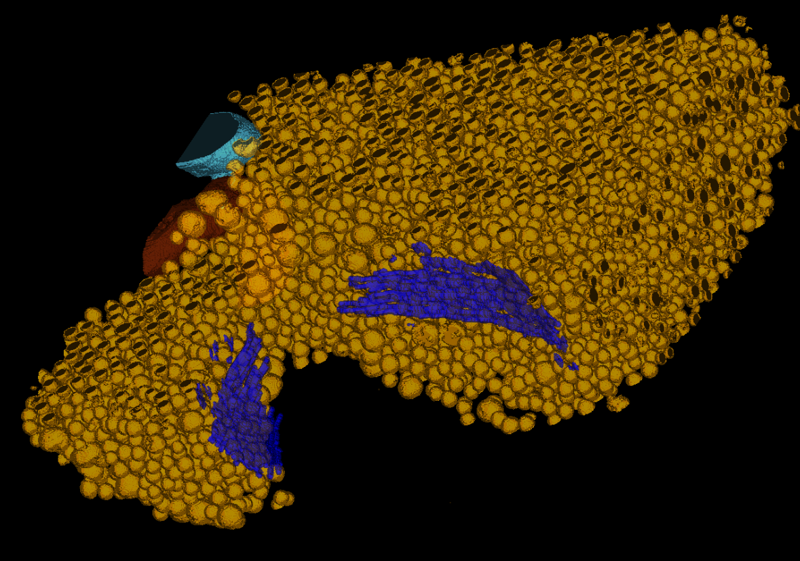

# SynapseNet: Deep Learning for Automatic Synapse Reconstruction

SynapseNet is a tool for segmentation and analysis of synapses in electron microscopy.

To learn how to use SynapseNet, check out [the documentation](https://computational-cell-analytics.github.io/synapse-net/).
To learn more about how it works, check out [our preprint](https://www.biorxiv.org/content/10.1101/2024.12.02.626387v1).

See an example reconstruction of a mossy fibre synapse with SynapseNet.
Automatic segmentation of synaptic vesicles are rendered in orange, active zones in blue and two mitochondria in red and cyan.

